# Experiment 1: Train TTSR on CUFED

### Goal

Validate that the available implementation of TTSR can be trained locally using the default parameters and datasets.

### Dataset
 - title: CUFED (The CUration of Flickr Events Dataset)
 - 11'871 train image pairs (image + reference image)
 - 756 test images
 - 160x160 resolution

### Train configuration

First two images are inputs, the third in an expected output:

| Input image (40x40)     |  Reference image (160x160)| Ground truth (160x160) |
:------------------------:|:-------------------------:|:-------------------------:
  |    |

## Exp1-1: Train TTSR (reconstruction loss only)

### Motivation

Train TTSR using a single loss function (reconstruction loss).

### Configuration

- batch size: 8
- epoch count: 30
- train time: ~11 hours
- rec_w = 1, all other = 0

### Results

#### Loss function

| Reconstruction loss     |
:-------------------------:
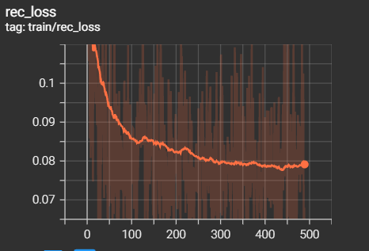

#### Metrics

| PSNR                     |         SSIM              |
:-------------------------:|:--------------------------:
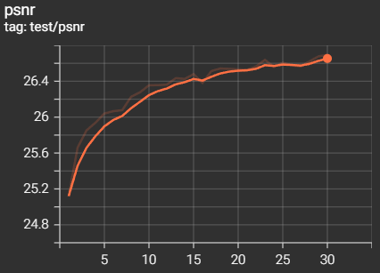  |  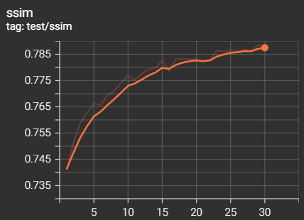

#### Samples

| Input image (40x40)     |  Reference image (160x160)| Inferred (160x160) | Inferred Scaled (160x160) |
:------------------------:|:-------------------------:|:-------------------------:|:-------------------------:
  |    |  | 

### Analysis

We can clearly see that the model can be trained further. The paper authors say the model needs 200 epochs to achieve PSNR of 27.09 (we're at 26.69). This seems feasible.

## Exp1-2: Train TTSR (all losses)

### Motivation

Train TTSR using all loss functions (reconstruction loss, adversarial loss, perceptual loss, transferal perceptual loss).

### Configuration

- batch size: 6
- epoch count: 30 + 2 (first two epochs only rec loss, then all losses)
- train time: ~13 hours
- rec_w = 1, per_w = 0.01, tpl_w = 0.01, adv_w = 0.01

### Results

#### Loss function

| Reconstruction loss            | Adversatial loss           | Perceptual loss           | T-Perceptual loss           |
:-------------------------------:|:--------------------------:|:--------------------------:|:--------------------------:
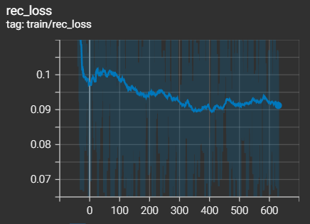  |  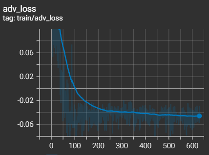|  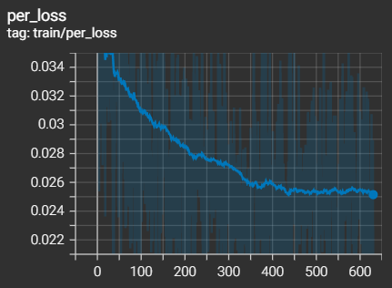|  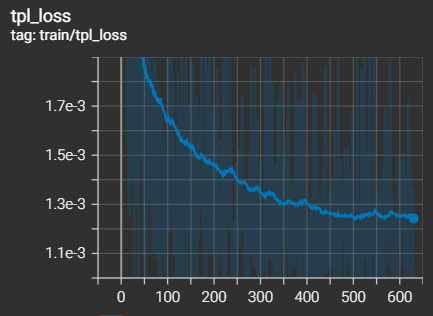

#### Metrics

| PSNR                     |         SSIM              |
:-------------------------:|:--------------------------:
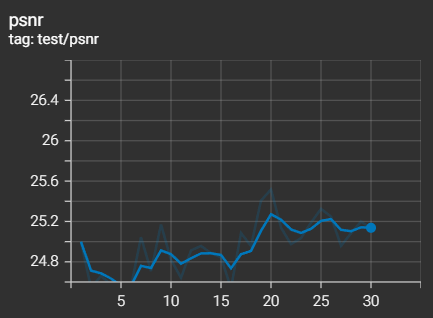  |  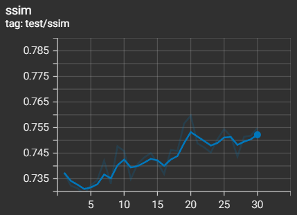

#### Samples

| Input image (40x40)     |  Reference image (160x160)| Inferred (160x160) | Inferred Scaled (160x160) |
:------------------------:|:-------------------------:|:-------------------------:|:-------------------------:
  |    | 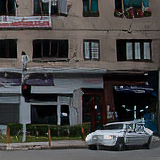 | 

### Analysis

The model performed a lot better than Exp1-1. It also seems it can be trained further (because loss functions didn't achieve saturation yet).

The PSNR/SSIM metrics of this model drastically differ from the previous (the best PSNR is 25.2 compared to 26.69 in Exp1-1), hovewer the visuals are lot more plausible. This confirms the sentence of the paper where authors said that high PSNR doesn't mean high quality perception for humans.

What's interesting is that adversarial loss became negative and decreases.

## Exp1-3: Train TTSR (larger batch size)

### Motivation

My GPU has limited memory (6Gb), so only relatively small batches can be used for training. In other to achieve higher training speeds, the memory bottleneck was identified and tuned.

The main memory bottleneck is computing attention map. For a 40x40 image the (256 * 9) x (40 * 40) feature matrix is collected, where 256 is the number of channels in the last layer of Learnable Texture Extractor and 3x3 kernels are extracted. Two matrices of this size are multiplied. For batch size of 6, each feature matrix is 0.5Gb each.

### Configuration

In the end of LTE one more Conv2D(256, 64) layer is added in order to decrease the memory pressure.

- batch size: 11
- epoch count: 30
- train time: ~15 hours
- rec_w = 1, all other = 0

### Results

#### Loss function

| Reconstruction loss (red + Exp1-1 in yellow) |
:-------------------------:
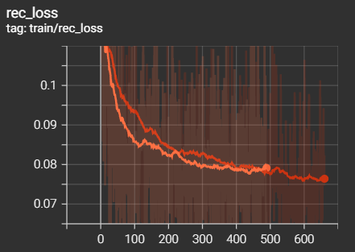

#### Metrics

| PSNR (+ Exp1-1)                     |         SSIM (+ Exp1-1)              |
:-------------------------:|:--------------------------:
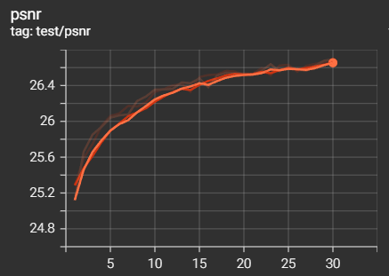  |  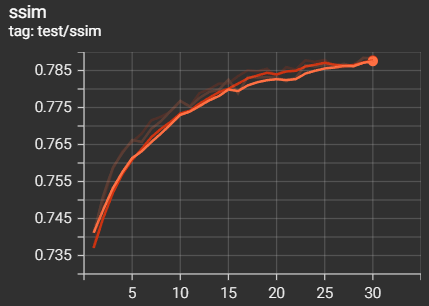

#### Samples

| Input image (40x40)     |  Reference image (160x160)| Inferred (160x160) | Inferred Scaled (160x160) |
:------------------------:|:-------------------------:|:-------------------------:|:-------------------------:
  |    |  | 

### Analysis

The train time actually increased, so this experiment failed. Also, the results are far from plausible. At the epoch 30 the model achieved the same PSNR of 26.69 as in Exp1-1.

## Summary

The inferred images:

| Rec loss only     |  All losses | Larger batch size (rec loss only) |
:------------------------:|:-------------------------:|:-------------------------:
 |  | 

We need to use all losses and the classical model.

