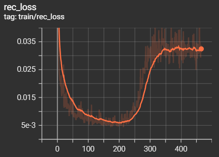
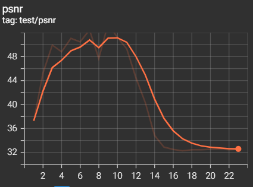
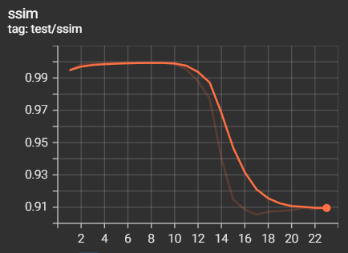
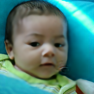

# Experiment 1: Train TTSR on CUFED

### Goal

Validate that the available implementation of TTSR can be trained locally using the default parameters and datasets.

### Dataset
 - title: FFHQ (Flickr-Faces-HQ Dataset)
 - 16'000 train images, 4'000 test images (80/20 train-test split)
 - 1024x1024 resolution
 - images were downscaled to 512x512, 384x384, 256x256, 160x160 for train time experiments

### Train configuration

First two images are inputs, the third in an expected output:

| Input image (40x40)     |  Reference image (160x160)| Ground truth (160x160) |
:------------------------:|:-------------------------:|:-------------------------:
  |    |

## Exp2-1: Test TTSR train time on different image sizes

TBA

## Exp2-2: Train TTSR for super-resolution

### Motivation

Check how TTSR behaves when the reference image is the desired output of the model. The model probably overfits.

### Configuration

- 160x160 images
- half of the dataset was used (8k train images and 2k test images)
- batch size: 8
- epoch count: 23
- train time: ~8 hours
- rec_w = 1, all other = 0

### Results

#### Loss function

| Reconstruction loss     |
:-------------------------:

#### Metrics

| PSNR                     |         SSIM              |
:-------------------------:|:--------------------------:
  |  

#### Samples (train set)

| Input image (40x40)     |  Reference image (160x160) |
:------------------------:|:--------------------------------:
  |  

| Inferred (epoch 5)     |  Inferred (epoch 10) | Inferred (epoch 15) | Inferred (epoch 20) |
:------------------------:|:-------------------------:|:-------------------------:|:-------------------------:
 |    |  | 

### Analysis

The model overfitted at epoch 10 and started hallucinating.

## Exp2-3: Train TTSR for super-resolution with inpainting

TBA