# Experiment 2: Train TTSR on FFHQ for inpainting

### Goal

Validate that the available implementation of TTSR can be trained locally using the default parameters and datasets.

### Dataset
 - title: FFHQ (Flickr-Faces-HQ Dataset)
 - 18'000 train images, 2'000 test images (90/10 train-test split)
 - 1024x1024 resolution
 - images were downscaled to 512x512, 384x384, 256x256, 160x160 for train time experiments

### Train configuration

First two images are inputs, the third in an expected output:

| Input image (40x40)     |  Reference image (160x160)| Ground truth (160x160) |
:------------------------:|:-------------------------:|:-------------------------:
  |    |

## Exp2-1: Test TTSR train time on different image sizes

### Motivation

Understand how long does the training process takes for different image sizes on my GPU.

### Configuration

- full dataset (18k train images and 2k test images)
- rec_w = 1, all other = 0 (only reconstruction loss is estimated)

### Results

| image size | batch size | estimated epoch train time |
|------------|------------|----------------------------|
| 512x512    | 1          | 4 hours                   |
| 384x384    | 1          | 2 hours                    |
| 256x256    | 4          | 1 hours                  |
| 160x160    | 8          | 0.5 hours                  |

### Analysis

We can test hypothesis on 160x160 images and validate them on higher resolution images.

## Exp2-2: Train TTSR for super-resolution

### Motivation

Check how TTSR behaves when the reference image is the desired output of the model. The model probably overfits.

### Configuration

- 160x160 images
- half of the dataset was used (8k train images and 2k test images)
- batch size: 8
- epoch count: 23
- train time: ~8 hours
- rec_w = 1, all other = 0

### Results

#### Loss function

| Reconstruction loss     |
:-------------------------:

#### Metrics

| PSNR                     |         SSIM              |
:-------------------------:|:--------------------------:
  |  

#### Samples (train set)

| Input image (40x40)     |  Reference image (160x160) |
:------------------------:|:--------------------------------:
  |  

| Inferred (epoch 5)     |  Inferred (epoch 10) | Inferred (epoch 15) | Inferred (epoch 20) |
:------------------------:|:-------------------------:|:-------------------------:|:-------------------------:
 |    |  | 

### Analysis

The model overfitted at epoch 10 and started hallucinating.

## Exp2-3: Train TTSR for super-resolution with inpainting

### Motivation

Check how TTSR behaves on the inpainting task, described in the beginning of the document.

### Configuration

- 160x160 images
- in the reference image pixels [0.5*w:0.8*w, 0.5*h:0.8*h] are blurred, all at the same place (~9% of the image) with ImageFilter.GaussianBlur = 5
- input image is a scaled down ref image
- full dataset was used (18k train images and 2k test images)
- batch size: 8
- epoch count: 7
- train time: ~8 hours
- rec_w = 1, per_w = 0.01, tpl_w = 0.01, adv_w = 0.01

### Results

#### Loss function

| Reconstruction loss            | Adversatial loss           | Perceptual loss           | T-Perceptual loss           |
:-------------------------------:|:--------------------------:|:--------------------------:|:--------------------------:
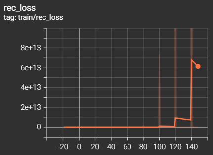  |  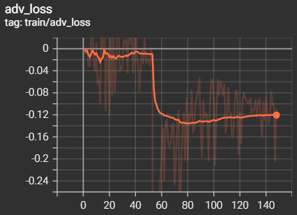|  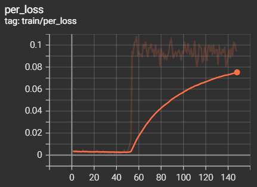|  

#### Metrics

| PSNR                     |         SSIM              |
:-------------------------:|:--------------------------:
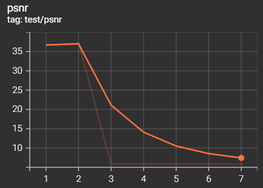  |  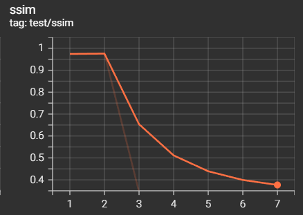

#### Samples (train set)

| Input image (40x40)     |  Reference image (160x160) |
:------------------------:|:--------------------------------:
  |  

| Inferred (epoch 1)     |  Inferred (epoch 2) | Inferred (epoch 3) |
:------------------------:|:-------------------------:|:-------------------------:
 |    | (white image) 

#### Samples (test set)

| Input image (40x40)     |  Reference image (160x160) |
:------------------------:|:--------------------------------:
  |  

| Inferred (epoch 1)     |  Inferred (epoch 2) | Inferred (epoch 3) |
:------------------------:|:-------------------------:|:-------------------------:
 |    | (white image) 

### Analysis

The model overfitted at epoch 2 and oveflowed afterwards.

## Exp2-4: Train TTSR for super-resolution with inpainting (higher res)

### Motivation

Check how TTSR behaves on the inpainting task. Observe when overfitting happens on higher resolution images (384x384). Try only reconstruction loss.

### Configuration

- 384x384 images
- in the reference image pixels [0.5*w:0.8*w, 0.5*h:0.8*h] are blurred, all at the same place (~9% of the image) with ImageFilter.GaussianBlur = 5
- input image is a scaled down ref image
- full dataset was used (18k train images and 2k test images)
- batch size: 1
- epoch count: 5
- train time: 8 hours
- rec_w = 1, all other = 0

### Results

#### Loss function

| Reconstruction loss             |
:---------------------------------:
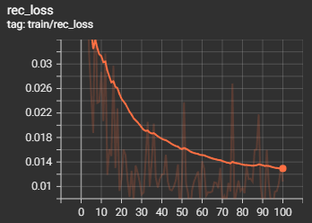   |

#### Metrics

| PSNR                     |         SSIM              |
:-------------------------:|:--------------------------:
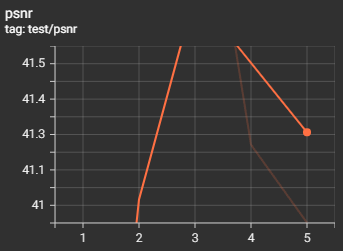  |  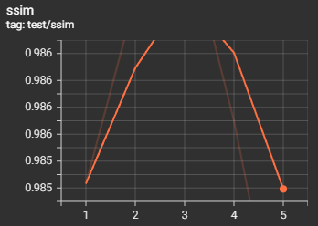

#### Samples (train set)

| Input image (96x96)     |  Reference image (384x384) |
:------------------------:|:--------------------------------:
  |  

| Inferred (epoch 1)     |  Inferred (epoch 3) | Inferred (epoch 5) |
:------------------------:|:-------------------------:|:-------------------------:
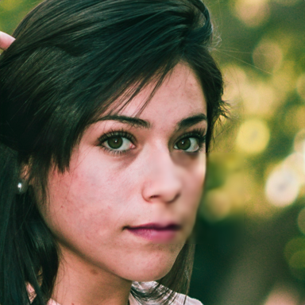 |  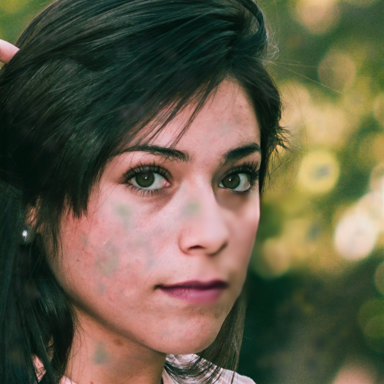  | 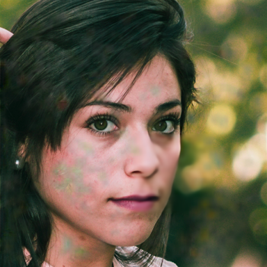

#### Samples (test set)

| Input image (96x96)     |  Reference image (384x384) |
:------------------------:|:--------------------------------:
  |  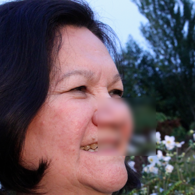

| Inferred (epoch 1)     |  Inferred (epoch 3) | Inferred (epoch 5) |
:------------------------:|:-------------------------:|:-------------------------:
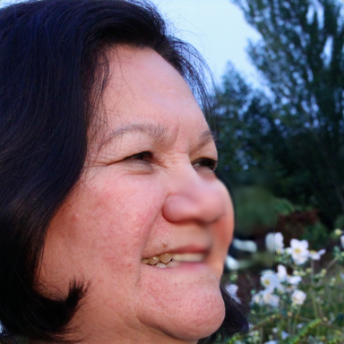 |    | 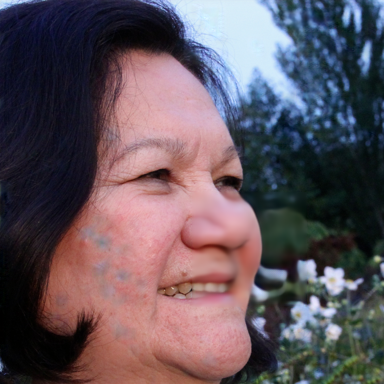

### Analysis

The model deblurred everything nicely but started adding green artifacts to the image.

## Exp2-5: Train TTSR for super-resolution with inpainting (higher res)

### Motivation

Check how TTSR behaves on the inpainting task. Observe when overfitting happens on higher resolution images (384x384). Try all losses (instead of only reconstruction loss in Exp2-4).

TBA

